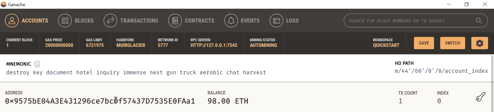
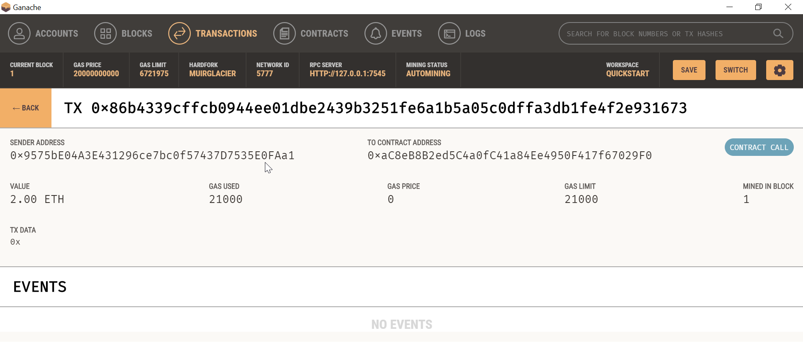

## Unit 19 Homework: Cryptocurrency Wallet

- - - 
&nbsp;     
### Streamlit Transaction 
- After adding the necessary code, the command - `streamlit run fintech_finder.py` was run in a terminal window.  
- The streamlit application opens in the default window.  
- The side bar displays the Client's ETH address and ETH balance (from the Ganache Wallet) and the selected Fintech Professional's ETH address and wage per hour.  
- The main body of the page displays the Fintech Professionals who are available to be hired.  
- The Fintech Professional Lane has been selected for the job for a period of 10.00 hours.  
- After the funds have been transfeerred, by clicking the Send Transaction button, to the Fintech Professional (Lane) a transaction hash is displayed.
- The image below provides a summary of the transaction that has occured.   
&nbsp;     
  
- - -
### Ganache Transaction  
- After navigation back to Ganache on the accounts screen we can see that the first account's ETH balance has gone down by 2 ETH.
- The accounts screen also displays that the account has a total transaction count of 1.
- The accounts screen also displays the mnemonic code and the addresses of all the ETH accounts in the Ganache wallet.
- The image below provides a summary of these details.  
&nbsp;      
  

- - -
### Ganache Transaction details  
- Clicking on the Transactions tab, displays a list of all the transactions that have occured in the ETH wallet.
- In this case we see a single transaction from the first address in the wallet to the Fintech Professional's ETH address.
- Also displayed are the Transaction hash, Gas used and the amount transferred to the professional.
- On clicking the transaction the screen displays few additional details associated with the transaction.
- The image below provides a summary of these details.  
&nbsp;  
  
